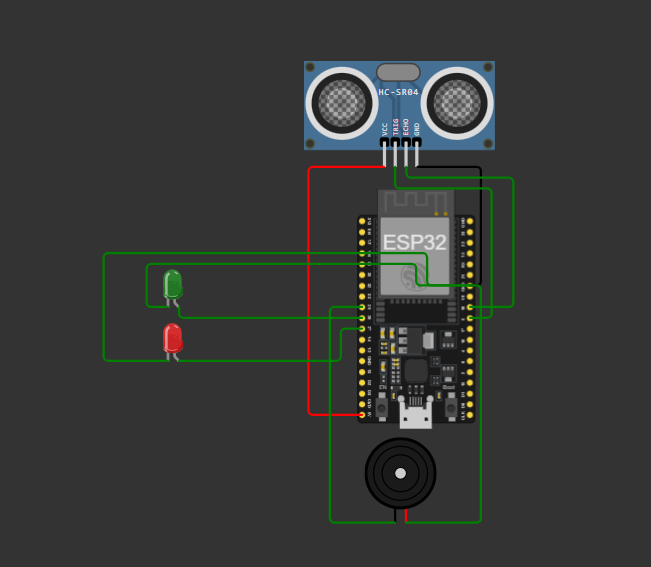
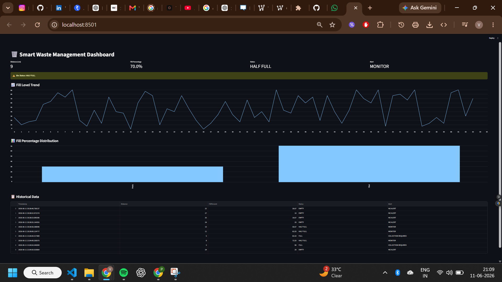
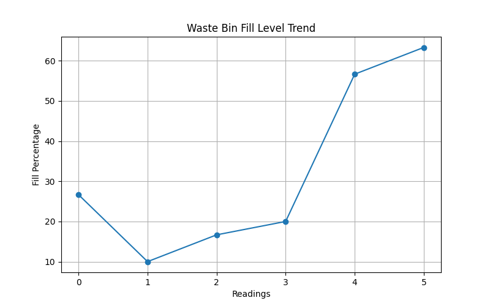

# 🗑️ Smart Waste Management & Bin Level Detection System

## 📌 Overview

The Smart Waste Management & Bin Level Detection System is an IoT-based solution designed to monitor waste bin fill levels in real time. The system uses an HC-SR04 Ultrasonic Sensor connected to an ESP32 microcontroller to measure the distance between the sensor and waste inside the bin.

Based on the measured distance, the system calculates the fill percentage and categorizes the bin status as:

- EMPTY
- HALF FULL
- FULL

Alerts are generated when the bin reaches a predefined threshold, enabling timely waste collection and reducing operational costs.

---

## 🚀 Problem Statement

Traditional waste collection follows fixed schedules regardless of whether bins are full or empty. This leads to:

- Overflowing bins
- Unnecessary collection trips
- Increased fuel consumption
- Higher operational costs
- Poor waste management efficiency

This project addresses these challenges through real-time monitoring and intelligent alert generation.

---

## 🎯 Objectives

- Monitor waste bin levels in real time
- Calculate fill percentage automatically
- Generate collection alerts
- Maintain historical records
- Visualize data through dashboards
- Generate monitoring reports

---

## 🏗️ System Architecture

```text
HC-SR04 Sensor
       ↓
ESP32 Controller
       ↓
Fill Level Calculation
       ↓
Alert Logic
       ↓
CSV Data Logging
       ↓
Streamlit Dashboard
       ↓
PDF Report Generation
```

---

## 🛠️ Technologies Used

### Hardware Simulation

- ESP32
- HC-SR04 Ultrasonic Sensor
- LED Indicators
- Buzzer
- Wokwi Simulator

### Software

- Python
- Pandas
- Streamlit
- Matplotlib
- ReportLab

---

## 📂 Project Structure

```text
Smart-Waste-Management-Bin-Level-Detection-System/
│
├── arduino_code/
│   ├── sketch.ino
│   └── diagram.json
│
├── python_simulation/
│   ├── bin_monitor.py
│   ├── auto_monitor.py
│   ├── plot_graph.py
│   └── generate_report.py
│
├── dashboard/
│   └── dashboard.py
│
├── data/
│   └── bin_log.csv
│
├── reports/
│   ├── fill_level_graph.png
│   └── waste_monitoring_report.pdf
│
├── images/
│
├── docs/
│
├── README.md
├── requirements.txt
```

---

## ✨ Features

- Real-time bin level monitoring
- Fill percentage calculation
- Empty / Half Full / Full classification
- LED-based visual alerts
- Buzzer-based audio alerts
- Automatic data logging
- Historical data tracking
- Streamlit dashboard
- PDF report generation
- IoT simulation using Wokwi

---

## 📊 Dashboard Features

- Distance Monitoring
- Fill Percentage Tracking
- Bin Status Monitoring
- Alert Notifications
- Historical Data Table
- Fill Level Trend Graph
- Fill Distribution Analysis

---

## Screenshots

### Circuit Diagram



### Dashboard



### Analytics Graph




## 📈 Sample Output

### Fill Percentage Formula

Fill Percentage = ((Bin Height - Distance) / Bin Height) × 100

Example:

Bin Height = 30 cm

Distance = 15 cm

Fill Percentage = 50%

Status = HALF FULL

---

## 📄 Generated Reports

The system generates:

- CSV Logs
- Fill Level Analytics Graphs
- PDF Monitoring Reports

---

## 🔮 Future Enhancements

- ThingSpeak Integration
- MQTT Communication
- Node-RED Dashboard
- Multiple Smart Bins
- GPS-enabled Collection Routes
- AI-based Waste Prediction
- Mobile Application Integration

---

## 🎓 Learning Outcomes

This project demonstrates:

- IoT Fundamentals
- Sensor Integration
- ESP32 Programming
- Data Logging
- Dashboard Development
- Data Visualization
- Report Generation
- Smart City Applications

---

## 👨‍💻 Author
**Varda Kunde**
Developed as an IoT Project for Smart Waste Management and Smart City Applications.
